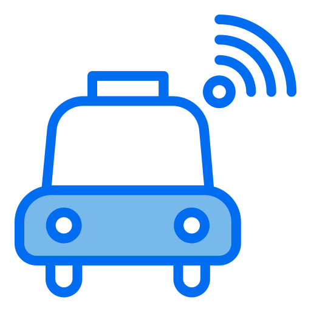
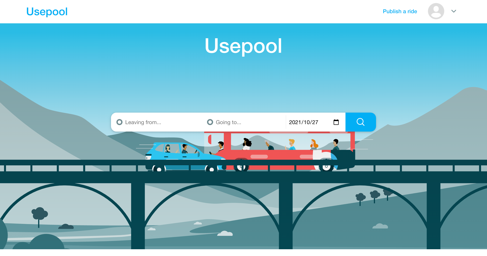
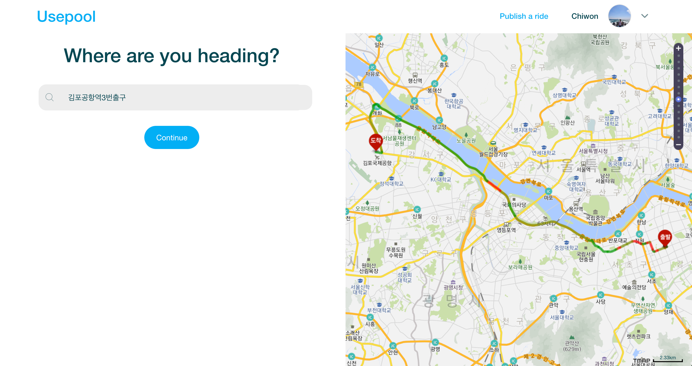
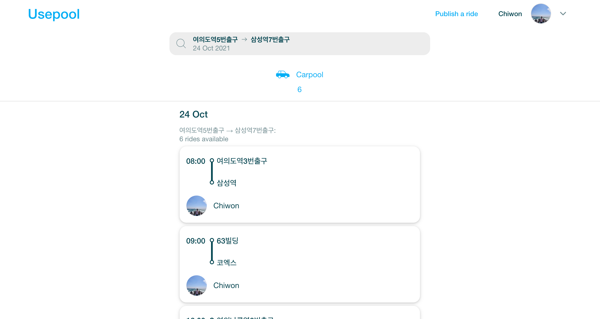
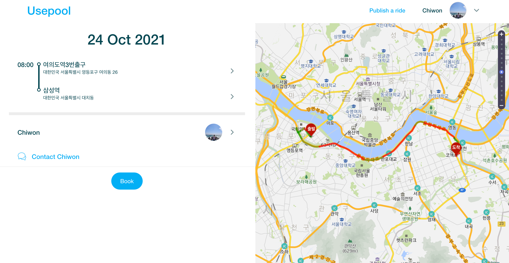
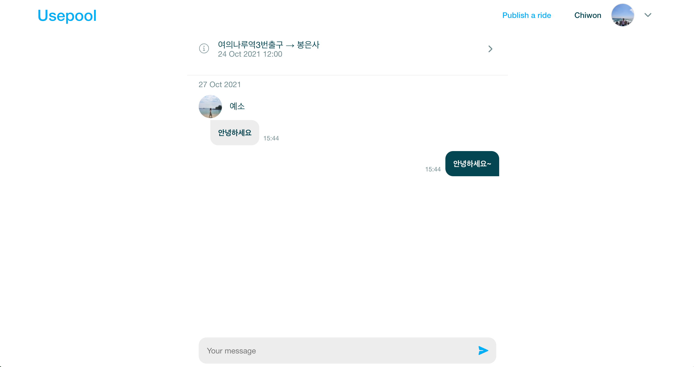
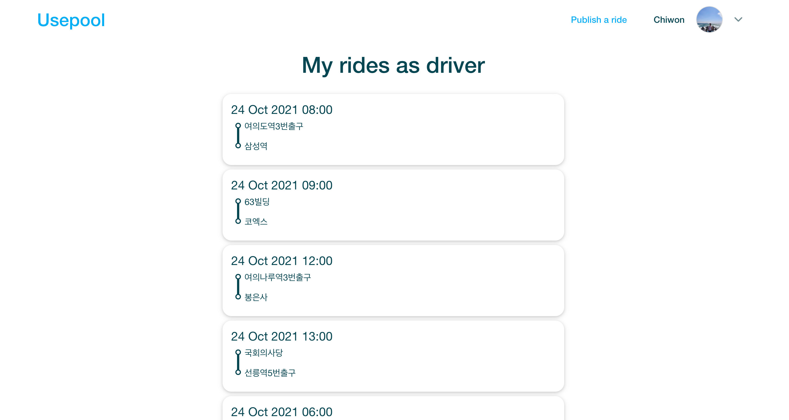

<h1 align="center">
  Usepool
</h1>

  

  
  
  
  
  

 

Usepool은 웹 상에서 간단히 이용할 수 있는 위치기반 카풀 매칭 서비스 입니다.

 
 

## Index

  <ol>
    <li><a href="#motivation">Motivation</a></li>
    <li><a href="#tech-stack">Tech Stack</a></li>
    <li><a href="#task-tool">Task Tool</a></li>
    <li><a href="#schedule">Schedule</a></li>
    <li><a href="#convention">Convention</a></li>
    <li><a href="#features">Features</a></li>
    <li><a href="#ui-example">UI Example</a></li>
    <li><a href="#demo">Demo</a></li>
    <li><a href="#challenge">Challenge</a></li>
    <li><a href="#about-tech-stack">About Tech Stack</a></li>
  </ol>

 
 

## Motivation

유럽여행 당시 프랑스에서 네덜란드까지 유럽의 한 카풀 서비스를 이용해서 이동한 적이 있습니다. 비용 절약 뿐만 아니라 드라이버 분과 이야기를 나누며 좋은 추억을 쌓으며, 한국에도 이러한 서비스가 있으면 좋겠다고 생각하였고, 이번 프로젝트를 기회로 제작해보게 되었습니다.

 
 

## Tech Stack

Base  
`React, Typescript`

Style  
`Styled-component`

Real-time Chat  
`Socket.io`

Caching  
`React-query`

Convention Management  
`Eslint`

Version Management  
`Git`

 
 

## Task Tool

- Scheduling: [Notion](https://fascinated-node-305.notion.site/0cfa84db6e11401eb72bd77b5dd22896?v=96156cb348b9420c880a13d9e1d1d239)
- Mockup Sketch: [Figma](https://www.figma.com/file/8LHV1mpnBs4eykXgzn5RSU/LGT?node-id=0%3A1)
- Information Archiving: Notion

 
 

## Schedule

[KANBAN](https://fascinated-node-305.notion.site/0cfa84db6e11401eb72bd77b5dd22896?v=96156cb348b9420c880a13d9e1d1d239)

개발기간 (09.27 ~ 10.15) 총 제작기간 19일

1주차 - 기획, POC

- 주제 선정
- [Mockup Sketch 제작](https://www.figma.com/file/8LHV1mpnBs4eykXgzn5RSU/LGT?node-id=0%3A1)
- Spec Check, Scheduling
- Convention 선정
- Directory Structure Setting

2주차 - 구현

- Front
  - UI Layout Setting
  - 카풀 검색 Algorithm 구현
  - 채팅 구현

3주차 - 마무리

- UI 개선작업
- Deploy
- Readme 작성
- Refactor

 
 

## Convention

- Coding Convention: [Google](https://google.github.io/styleguide/jsguide.html)
- [Commit Message Convention](https://github.com/helderburato/dotfiles/blob/main/git/.gittemplates/commit)

 
 

## Features

- 운전자는 장소를 검색하여 카풀 생성
- 탑승자는 입력한 장소를 기반으로 근거리 카풀 검색 가능
- 운전자와 탑승자는 실시간 채팅으로 의사소통

 
 

## UI Example

| Home Page                                                                         | New Carpool                                                                    |
| --------------------------------------------------------------------------------- | ------------------------------------------------------------------------------ |
|      |     |
| Search                                                                            | Carpool details                                                                |
|  |  |
| Chat                                                                              | My page                                                                        |
|                |         |

   
   

## Demo

[Demo Link](https://usepool.online)

### Client

- Netlify를 이용하여 애플리케이션 배포 및 관리

### Server

- AWS Elastic Beanstalk를 사용하여 애플리케이션 배포 및 관리
- Amazon ACM (AWS Certificate Manager)을 사용한 SSL 관리 (HTTPS Protocol)
   
   

## Challenge

1. Restful 한 채팅 로직 작성

   - 문제점
     - 최초 채팅 구현 시 Socket Listener 내부에서 Database에 채팅을 기록 하도록 되어 있어서 Restful 하지 못하였음
   - 해결
     - 채팅 전송시 post 요청으로 채팅이 Database에 기록 된 후 해당 Endpoint의 마지막에서 Listener들에게 생성된 채팅 Data를 내려주도록 로직 수정

2. 사용자가 의도한 장소 입력

   - 문제점
     - 사용자는 같은 장소에 대해서도 번지수, 장소명 등 여러 방식으로 장소를 검색할 가능성이 있어, 사용자가 기대하는 장소가 입력되며 동시에 경, 위도 좌표를 입력받을 수 있도록 하는 것이 필요하였음
   - 해결책
     - 자동완성을 통하여 장소 입력하도록 ui를 구성하여, 사용자는 본인이 기대하는 장소를 입력할 수 있도록 하였으며, 항상 좌표를 입력 받을 수 있게 되었음

 
 

## About Tech Stack

1. Typescript

   - 지도 API, Socket, Props 및 Server-Client 간 주고받는 데이터 데이터 등 다양한 데이터를 조작해야 하는 상황에서, 런타임 에러를 방지하고 디버깅 속도를 향상시키기 위해 도입하였고, 결과적으로 기한 내에 프로젝트를 마무리 할 수 있었습니다.

2. React-query

   - 다수의 사용자가 동시에 사용할 가능성이 있는 서비스이기 때문에, 카풀 검색 결과 등의 서버에서 가져온 데이터에 대해 무결성을 향상시키기 위하여 도입하였습니다.
